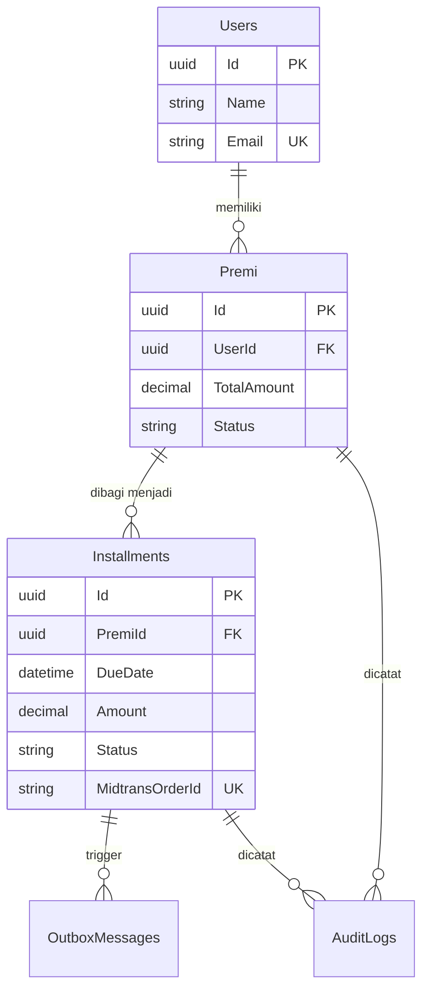

# 🚀 Rekomendasi Arsitektur Backend

Berdasarkan tujuan sistem untuk **MVP Payment Installment System**, berikut adalah rencana rekomendasi teknis untuk pembuatan backend menggunakan **.NET 8** dan **Supabase (PostgreSQL)**.

---

## 1. Skema Database (PostgreSQL)

Gunakan PostgreSQL di Supabase untuk memastikan integritas data (ACID) dan Idempotency.

### Tabel Utama

#### **Users**

Menyimpan informasi dasar pengguna.
| Column | Type | Description |
| :--- | :--- | :--- |
| `Id` | `uuid` (PK) | Unique identifier |
| `Name` | `varchar(255)` | Nama lengkap |
| `Email` | `varchar(255)` (Unique) | Email untuk login |
| `TelegramChatId` | `varchar(100)` | Chat ID untuk notifikasi reminder |
| `CreatedAt` | `timestamp` | Waktu pembuatan akun |

#### **Premi**

Informasi total hutang/premi yang harus dibayar.
| Column | Type | Description |
| :--- | :--- | :--- |
| `Id` | `uuid` (PK) | Unique identifier |
| `UserId` | `uuid` (FK) | Pemilik premi |
| `TotalAmount` | `decimal(18,2)` | Total nilai premi |
| `InstallmentAmount`| `decimal(18,2)` | Nilai per cicilan |
| `Tenor` | `int` | Jumlah bulan cicilan |
| `DueDay` | `int` | Tanggal jatuh tempo per bulan (1-31) |
| `GracePeriodDays` | `int` | Masa tenggang sebelum status Overdue |
| `Status` | `enum` | `Active`, `Completed`, `Cancelled` |
| `CreatedAt` | `timestamp` | Waktu pembuatan |

#### **Installments** (Jantung dari sistem)

Detail cicilan bulanan.
| Column | Type | Description |
| :--- | :--- | :--- |
| `Id` | `uuid` (PK) | Unique identifier |
| `PremiId` | `uuid` (FK) | Induk premi |
| `InstallmentNumber`| `int` | Urutan cicilan (1, 2, 3...) |
| `DueDate` | `date` | Tanggal jatuh tempo spesifik |
| `Amount` | `decimal(18,2)` | Besaran cicilan |
| `Status` | `enum` | `Pending`, `Reminder1Sent`, `Reminder2Sent`, `Paid`, `Overdue` |
| `MidtransOrderId` | `varchar(255)` (Unique) | Order ID unik untuk Midtrans |
| `PaidAt` | `timestamp` | Waktu pembayaran diverifikasi |
| `RowVersion` | `bytea` | Mengatasi Concurrency (Optimistic Lock) |

### Tabel Pendukung (Reliability)

#### **OutboxMessages**

Untuk pengiriman Telegram yang aman (Outbox Pattern).

- `Id`, `Type` (Reminder/Success), `Payload` (JSON), `IsProcessed`, `RetryCount`.

#### **AuditLogs**

Mencatat setiap perubahan status finansial untuk audit trail.

- `Id`, `Entity`, `EntityId`, `Action`, `Metadata`, `CreatedAt`.

---

## 2. Entity Relationship Diagram (ERD)

---

## 3. Rencana API Endpoints

Gunakan RESTful API yang terdokumentasi dengan Swagger.

### 🔐 Authentication (`Auth`)

- `POST /api/auth/login`: Login admin/user dan mendapatkan JWT.

### 🛡 Admin Endpoints (`Admin`)

- **Dashboard**: `GET /api/admin/metrics` - Menampilkan total active, overdue, dan revenue (untuk MetricsCards).
- **Premi Management**:
  - `POST /api/admin/premi`: Membuat premi baru (otomatis generate `Installments`).
  - `GET /api/admin/premi`: List semua premi aktif.
  - `GET /api/admin/premi/{id}`: Detail premi dan daftar cicilannya.
- **Reporting**: `GET /api/admin/installments/overdue`: List cicilan yang menunggak.

### 👤 User Endpoints (`User`)

- **My Payments**: `GET /api/user/installments` - Melihat daftar cicilan milik user yang sedang login.
- **Payment Action**: `POST /api/user/installments/{id}/pay` - Generate Midtrans Snap Token untuk cicilan tertentu.
- **Create User**: `POST /api/user` - Mendaftarkan user baru ke sistem.
- **Update User**: `PUT /api/user/{id}` - Memperbarui data profil user berdasarkan ID.

### 💳 Integration (`Midtrans`)

- **Webhook**: `POST /api/midtrans/webhook` - Endpoint publik untuk menerima konfirmasi pembayaran sukses dari Midtrans.

---

## 💡 Rekomendasi Langkah Awal

1. **Setup Database**: Buat tabel di Supabase berdasarkan skema di atas.
2. **Backend Project**: Inisialisasi .NET Web API dan pasang Npgsql (driver PostgreSQL).
3. **Core Logic**: Buat service untuk `Premi` -> `Installment` generation.
4. **Integration**: Setup Midtrans Sandbox dan integrasikan Snap API.
