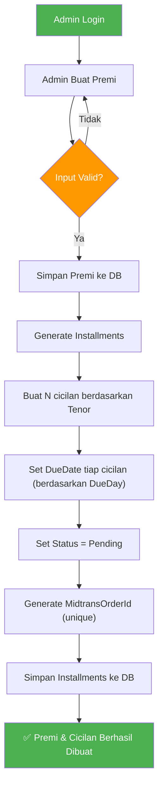
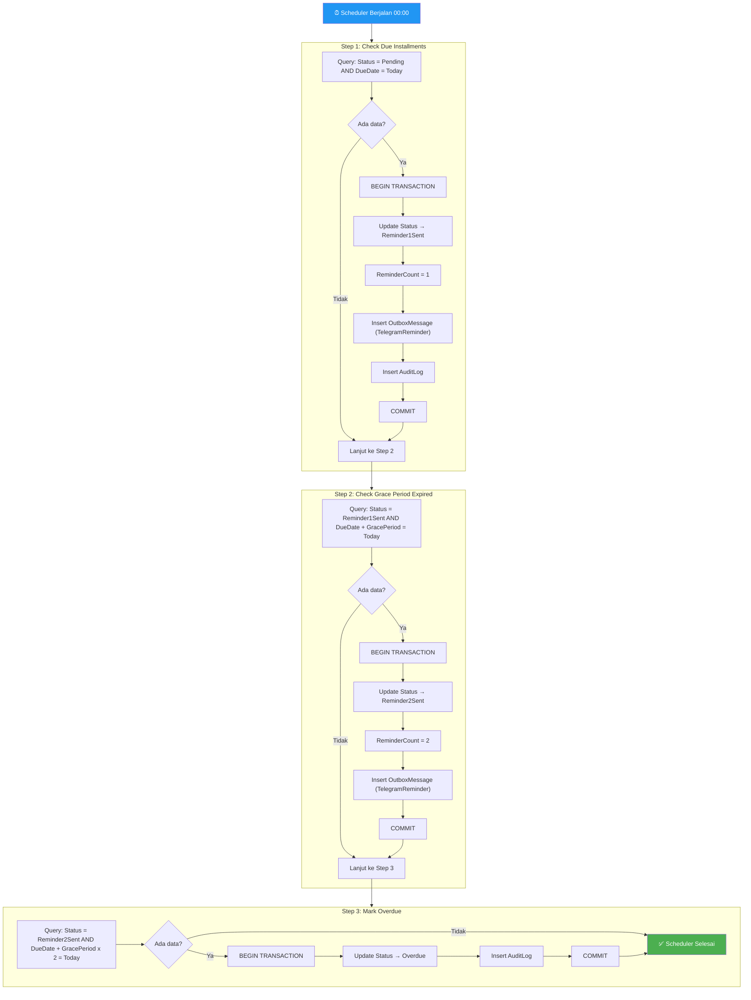
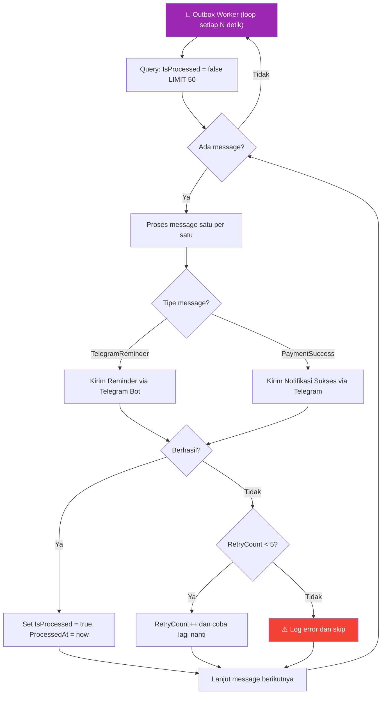
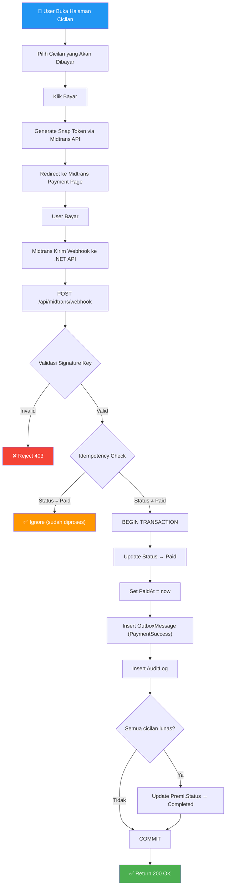
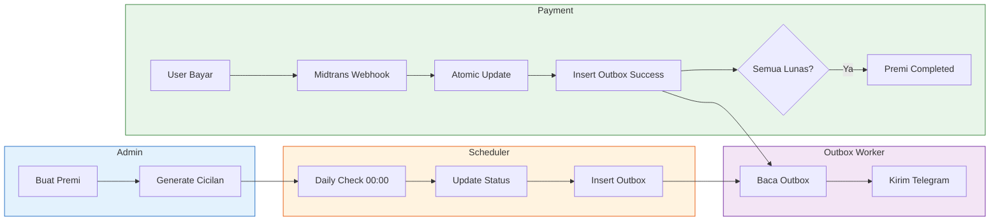
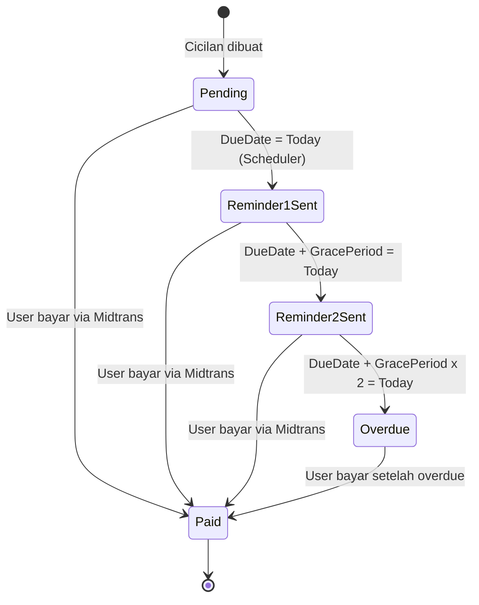
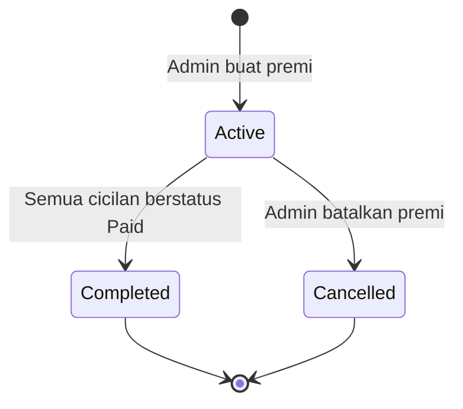

# 📈 Business Flow Diagram

## MVP Payment Installment System

---

## 1. Flow Utama – Admin Membuat Premi & Generate Cicilan

---

## 2. Flow Scheduler Harian (00:00)

---

## 3. Flow Outbox Worker

---

## 4. Flow Pembayaran User via Midtrans

---

## 5. Flow Lengkap End-to-End

---

## 6. Status Transition Diagram – Installment

---

## 7. Status Transition Diagram – Premi

