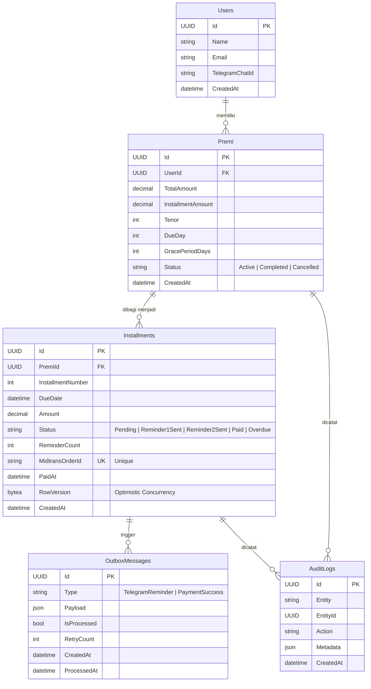

# 📊 Entity Relationship Diagram (ERD)

## MVP Payment Installment System

## Penjelasan Relasi

| Relasi                        | Tipe        | Keterangan                                                                                      |
| ----------------------------- | ----------- | ----------------------------------------------------------------------------------------------- |
| Users → Premi                 | One-to-Many | Satu user bisa memiliki banyak premi                                                            |
| Premi → Installments          | One-to-Many | Satu premi dipecah menjadi beberapa cicilan berdasarkan tenor                                   |
| Installments → OutboxMessages | One-to-Many | Setiap perubahan status installment bisa menghasilkan outbox message (reminder/payment success) |
| Installments → AuditLogs      | One-to-Many | Setiap perubahan installment dicatat di audit log                                               |
| Premi → AuditLogs             | One-to-Many | Perubahan status premi juga dicatat                                                             |

## Constraints

- **Unique**: `Installments.MidtransOrderId` – mencegah duplikasi order ke Midtrans
- **Unique Composite**: `Installments(PremiId, InstallmentNumber)` – mencegah duplikasi nomor cicilan per premi
- **Optimistic Concurrency**: `Installments.RowVersion` – mencegah race condition saat update bersamaan
